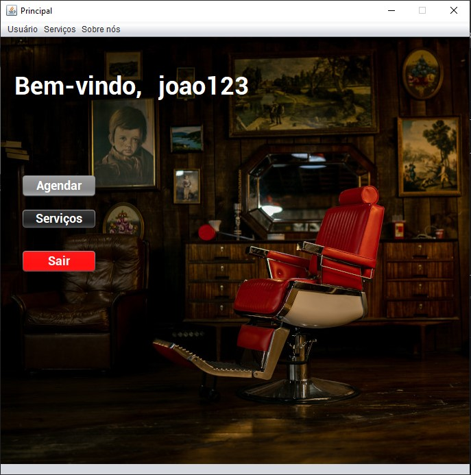
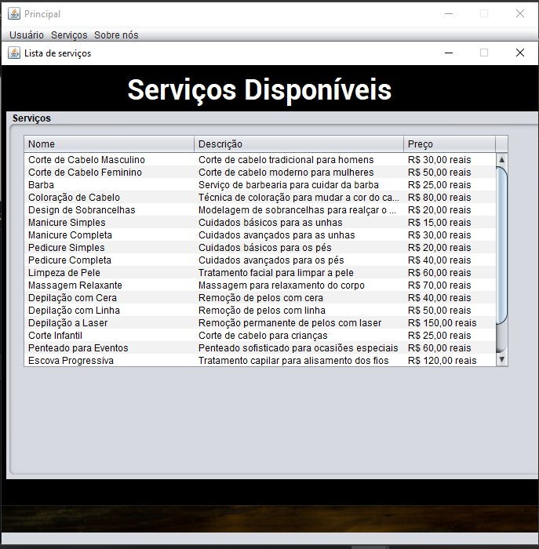

# Barbearia 

 - Esse projeto consiste em um projeto utilizando as tecnologias Java, JDBC, Java Swing e MySQL para criação 
   de um aplicativo desktop para cadastro de clientes e de funcionários para barbearias que desejam
   ter um controle de seus compromissos.

## Tela de Login

## Tela Principal

## Tela de Serviços

# Programas necessários 

* Instalação do MySQL Community Server
* Instalação do Java JRE ou JDK 19

          

  
  

Links:
- [__MySQL Server__](https://dev.mysql.com/downloads/) 
- [__JDK 19__](https://www.oracle.com/java/technologies/javase/jdk19-archive-downloads.html)
- [__JRE__](https://www.java.com/pt-BR/download/manual.jsp)

# Configurações MySQL 

1. Definir as seguintes informações do usuário do MySQL
* __USUARIO__: root
* __SENHA__:12345
2. É necessário rodar a query do arquivo "query-barbearia.sql" seja previamente para que possa ser 
criado o banco de dados e inseridos os registros de forma local na máquina.

# Testando a aplicação

1. Vá até a pasta AdemirCortes/dist/ e depois execute o arquivo __*BarbeariaTrabalho.jar*__
2. Posteriormente insira o respectivo e-mail abaixo:
* __E-mail:__ joao.silva@ademircortes.com.br
* __Senha:__ senha123

# Bibliotecas 

### __Nome da Biblioteca__: geradorcpf-orlando
* __Link de acesso:__ https://github.com/orlando-dev/gerador-cpf
* __Nome do Autor:__ Orlando Junior

### __Nome da Biblioteca__: Connector/j
* __Link de acesso:__ https://dev.mysql.com/downloads/connector/j/

