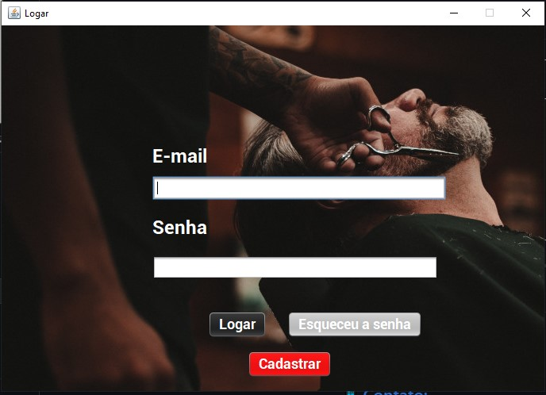

# Barbearia 

 - Esse projeto consiste em um projeto utilizando as tecnologias Java, JDBC, Java Swing e MySQL para criação 
   de um aplicativo desktop para cadastro de clientes e de funcionários para barbearias que desejam
   ter um controle de seus compromissos.

## Tela de Login

## Tela Principal

## Tela de Serviços

